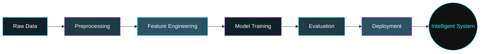

<!--
  ██████╗ ███████╗██████╗ ███████╗███╗   ██╗██████╗ ██████╗  █████╗
  ██╔══██╗██╔════╝██╔══██╗██╔════╝████╗  ██║██╔══██╗██╔══██╗██╔══██╗
  ██║  ██║█████╗  ██████╔╝█████╗  ██╔██╗ ██║██║  ██║██████╔╝███████║
  ██║  ██║██╔══╝  ██╔══██╗██╔══╝  ██║╚██╗██║██║  ██║██╔══██╗██╔══██║
  ██████╔╝███████╗██████╔╝███████╗██║ ╚████║██████╔╝██║  ██║██║  ██║
  ╚═════╝ ╚══════╝╚═════╝ ╚══════╝╚═╝  ╚═══╝╚═════╝ ╚═╝  ╚═╝╚═╝  ╚═╝
  Thanks for peeking at the source. This profile was hand-crafted
  with love, caffeine, and a healthy respect for div centering.
-->

<div align="center">


<br/>

<a href="https://git.io/typing-svg">
  
</a>

<br/><br/>


[](https://github.com/Debendra-dotcom?tab=followers)
[](https://github.com/Debendra-dotcom?tab=repositories)

</div>

<!-- ============================================================ -->
<!--  NAV / QUICK LINKS                                            -->
<!-- ============================================================ -->

<p align="center">
  <a href="#-about-me">About</a> •
  <a href="#-tech-arsenal">Tech Stack</a> •
  <a href="#-ai--machine-learning">AI/ML</a> •
  <a href="#-featured-projects">Projects</a> •
  <a href="#-github-analytics">Stats</a> •
  <a href="#-goals-for-2026">Goals</a> •
  <a href="#-lets-connect">Contact</a>
</p>

<p align="center">
  
  
  
</p>

<div align="center">

```
> whoami
Debendranath Malik — B.Tech CSE (Artificial Intelligence)
> mission
Engineering intelligent, elegant, and scalable software
> status
[ ONLINE ] — compiling ideas into code, 24/7
```

</div>

<br/>

<!-- ============================================================ -->
<!--  ABOUT ME                                                    -->
<!-- ============================================================ -->

## 🧬 About Me


- 🎓 Pursuing **B.Tech in Computer Science Engineering (Artificial Intelligence)**
- 🌱 On a mission to become a **Software Engineer, AI Engineer & Machine Learning Engineer**
- 💡 Passionate about building things that sit at the intersection of **software craftsmanship** and **intelligent systems**
- 🧠 Deeply curious about how machines learn, reason, and perceive the world
- 🛠️ I love turning abstract ideas into working prototypes — fast
- 📚 Currently deep-diving into **Deep Learning, Django, DSA, and Cloud Computing**
- 🧩 Strong believer in clean code, solid fundamentals, and continuous learning
- ⚡ Fun fact: I debug faster with a cup of coffee in hand ☕
- 📍 Based in **Bhubaneswar, Odisha, India** — open to remote & on-site opportunities

<br clear="right"/>

> *"I don't just write code — I engineer solutions."*

<br/>

<!-- ============================================================ -->
<!--  QUOTE OF THE DAY                                             -->
<!-- ============================================================ -->

<div align="center">

### 💬 Quote of the Moment


</div>

<br/>

<!-- ============================================================ -->
<!--  TECH ARSENAL                                                 -->
<!-- ============================================================ -->

## ⚙️ Tech Arsenal

<div align="center">

### 🧠 Languages & Core


### 🗄️ Data & Backend


### 🤖 AI / ML / Data Science


### 🛠️ Tools & Platforms


### ☁️ Cloud & DevOps *(currently learning)*


### 🎨 Frontend & Design


### 🧰 Extras


</div>

<br/>

<!-- ============================================================ -->
<!--  SKILL PROGRESS BARS                                         -->
<!-- ============================================================ -->

## 📊 Skill Proficiency

<div align="center">

| Skill | Proficiency | Level |
|:------|:------------|:------|
| 🐍 **Python** | ████████████████████ 90% | Advanced |
| ☕ **Java** | ███████████████░░░░░ 75% | Proficient |
| 🌐 **JavaScript** | ██████████████░░░░░░ 70% | Proficient |
| 🔵 **C** | ███████████████░░░░░ 75% | Proficient |
| 🎨 **HTML / CSS** | ██████████████████░░ 85% | Advanced |
| 🗃️ **SQL** | ███████████████░░░░░ 75% | Proficient |
| 🧩 **Django** | █████████████░░░░░░░ 65% | Growing |
| 🤖 **TensorFlow** | ████████████░░░░░░░░ 60% | Growing |
| 📈 **Scikit-learn** | █████████████░░░░░░░ 65% | Growing |
| 🧮 **Pandas / NumPy** | ████████████████░░░░ 80% | Proficient |
| 🔧 **Git / GitHub** | ██████████████████░░ 88% | Advanced |

</div>

<br/>

---

<br/>

<!-- ============================================================ -->
<!--  AI & MACHINE LEARNING                                        -->
<!-- ============================================================ -->

## 🤖 AI & Machine Learning


I'm building a strong foundation in Artificial Intelligence — from classical ML algorithms to modern deep learning architectures. My current AI/ML journey includes:

- 🔍 **Computer Vision** — image classification & detection pipelines
- 📈 **Predictive Modeling** — regression & classification with Scikit-learn
- 🧠 **Neural Networks** — building and training models with TensorFlow
- 🧪 **Data Wrangling** — cleaning, transforming & analyzing datasets with Pandas & NumPy
- 🗣️ **NLP & Conversational AI** — exploring intelligent assistants
- 📚 Continuously studying research papers to stay current with the field

<br clear="left"/>

<div align="center">



</div>

<br/>

## 💻 Software Engineering

- 🏗️ Strong grasp of **OOP principles**, clean architecture, and maintainable code
- 🔗 Experience building **full-stack web applications** with Django & JavaScript
- 🗄️ Comfortable designing and querying **relational databases** with SQL
- 🧪 Practicing **DSA** consistently to sharpen problem-solving skills
- 🔄 Familiar with **Git workflows**, version control, and collaborative development
- 🚀 Learning to design systems that scale, following industry best practices

<br/>

## 🌍 Open Source

<div align="center">

[](https://github.com/Debendra-dotcom)


I'm actively looking to contribute to open-source projects in **AI/ML, Django, and Developer Tools**. Contributions, issues, and PRs are always welcome on my repositories!

</div>

<br/>

---

<br/>

<!-- ============================================================ -->
<!--  FEATURED PROJECTS                                            -->
<!-- ============================================================ -->

## 🚀 Featured Projects

<div align="center">

<table>
<tr>
<td width="50%">

### 🧠 AI Assistant
Personal AI-powered voice/text assistant capable of handling everyday tasks and queries using NLP techniques.

`Python` `AI` `NLP` `Automation`

[](https://github.com/Debendra-dotcom)

</td>
<td width="50%">

### 🌸 Flower Detection
Deep learning image classification model that identifies flower species from images using CNN architectures.

`Python` `TensorFlow` `CNN` `Computer Vision`

[](https://github.com/Debendra-dotcom)

</td>
</tr>
<tr>
<td width="50%">

### 👤 Face Detection
Real-time face detection system built with OpenCV and machine learning models for identity recognition tasks.

`Python` `OpenCV` `ML` `Computer Vision`

[](https://github.com/Debendra-dotcom)

</td>
<td width="50%">

### 📱 Mobile Price Prediction
ML regression/classification model predicting mobile phone price ranges based on hardware specifications.

`Python` `Scikit-learn` `Pandas` `ML`

[](https://github.com/Debendra-dotcom)

</td>
</tr>
<tr>
<td width="50%">

### 🛒 Shopping Website
Full-stack e-commerce web application with product listings, cart functionality, and clean UI/UX.

`Django` `HTML/CSS` `JavaScript` `SQL`

[](https://github.com/Debendra-dotcom)

</td>
<td width="50%">

### 🌦️ Weather App
Real-time weather forecasting web app fetching live data via API with a clean, responsive interface.

`JavaScript` `API` `HTML/CSS`

[](https://github.com/Debendra-dotcom)

</td>
</tr>
</table>

[](https://github.com/Debendra-dotcom?tab=repositories)

</div>

<br/>

---

<br/>

<!-- ============================================================ -->
<!--  GITHUB ANALYTICS                                             -->
<!-- ============================================================ -->

## 📈 GitHub Analytics

<div align="center">


<br/>


</div>

<br/>

### 🔥 Contribution Graph

<div align="center">


</div>

<br/>

### 🏆 Trophy Room

<div align="center">


</div>

<br/>

### 🐍 Contribution Snake

<div align="center">


<sub>⚙️ Snake animation auto-generates via GitHub Actions — see setup note at the bottom of this README.</sub>

</div>

<br/>

---

<br/>

<!-- ============================================================ -->
<!--  CURRENT FOCUS                                                -->
<!-- ============================================================ -->

## 🎯 Current Focus

<div align="center">

| 🔭 Area | 📌 Details |
|:---|:---|
| **Deep Learning** | Neural networks, CNNs & model optimization |
| **Django** | Building production-ready full-stack apps |
| **DSA** | Strengthening problem-solving for technical interviews |
| **Cloud Computing** | AWS / GCP fundamentals & deployment pipelines |
| **Machine Learning** | Advanced algorithms & real-world datasets |

</div>

<br/>

## 🗓️ Goals for 2026

- [ ] 🎯 Land a role as a **Software Engineer / AI Engineer**
- [ ] 🧠 Complete an advanced **Deep Learning specialization**
- [ ] 🏗️ Ship **3+ production-grade full-stack projects**
- [ ] ☁️ Get hands-on certified in **Cloud Computing (AWS/GCP)**
- [ ] 🧩 Solve **300+ DSA problems** across platforms
- [ ] 🌍 Make **meaningful open-source contributions**
- [ ] 📝 Publish technical articles on **Dev.to / Medium**
- [ ] 🤝 Grow a strong developer network & mentor others

<br/>

---

<br/>

<!-- ============================================================ -->
<!--  FUN FACTS                                                    -->
<!-- ============================================================ -->

## 🎲 Fun Facts

<div align="center">

<table>
<tr>
<td align="center">☕<br/><b>Fuel</b><br/>Coffee-driven development</td>
<td align="center">🌙<br/><b>Peak Hours</b><br/>Best code written at night</td>
<td align="center">🧩<br/><b>Hobby</b><br/>Solving logic puzzles & DSA</td>
<td align="center">🎧<br/><b>Vibe</b><br/>Lo-fi beats while coding</td>
</tr>
</table>

</div>

<br/>

---

<br/>

<!-- ============================================================ -->
<!--  CODING PROFILES                                              -->
<!-- ============================================================ -->

## 👨‍💻 Coding Profiles

<div align="center">

[](https://leetcode.com/Debendra-dotcom)
[](https://www.hackerrank.com/Debendra-dotcom)
[](https://www.codechef.com/users/Debendra-dotcom)
[](https://www.geeksforgeeks.org/user/Debendra-dotcom)

</div>

<br/>

## ✍️ Writing & Community

<div align="center">

[](https://dev.to/Debendra-dotcom)
[](https://medium.com/@Debendra-dotcom)
[](https://stackoverflow.com/users/Debendra-dotcom)
[](https://discord.com/users/Debendra-dotcom)

</div>

<br/>

---

<br/>

<!-- ============================================================ -->
<!--  CONTACT                                                      -->
<!-- ============================================================ -->

## 📬 Let's Connect

<div align="center">

I'm always open to discussing **AI/ML projects, software engineering roles, internships, freelance work, or open-source collaboration**. Reach out — I usually respond within a day!

<a href="mailto:your-email@example.com">
  
</a>
<a href="https://linkedin.com/in/Debendra-dotcom">
  
</a>
<a href="#">
  
</a>
<a href="https://twitter.com/Debendra_dotcom">
  
</a>
<a href="https://instagram.com/Debendra.dotcom">
  
</a>

</div>

<br/>

---

<br/>

<!-- ============================================================ -->
<!--  SUPPORT / SPONSOR                                            -->
<!-- ============================================================ -->

## ☕ Support My Work

<div align="center">

If you find my projects useful or inspiring, consider fueling my next build with a coffee, or sponsoring my open-source journey — every bit of support helps me keep learning and shipping!

<a href="https://www.buymeacoffee.com/Debendra.dotcom">
  
</a>
<a href="https://github.com/sponsors/Debendra-dotcom">
  
</a>

</div>

<br/>

---

<br/>

<!-- ============================================================ -->
<!--  SNAKE WORKFLOW SETUP NOTE                                    -->
<!-- ============================================================ -->

<!--
  To activate the live contribution snake animation above, add this
  GitHub Actions workflow at:
  .github/workflows/snake.yml

  name: Generate Snake
  on:
    schedule:
      - cron: "0 */6 * * *"
    workflow_dispatch: {}
    push:
      branches: [ main ]

  jobs:
    generate:
      runs-on: ubuntu-latest
      permissions:
        contents: write
      steps:
        - uses: Platane/snk@v3
          with:
            github_user_name: Debendra-dotcom
            outputs: |
              dist/github-contribution-grid-snake-dark.svg?palette=github-dark
              dist/github-contribution-grid-snake.svg
        - uses: crazy-max/ghaction-github-pages@v4
          with:
            target_branch: output
            build_dir: dist
          env:
            GITHUB_TOKEN: ${{ secrets.GITHUB_TOKEN }}
-->

<div align="center">

### 🌌 Thanks for stopping by!


*"Code is like humor. When you have to explain it, it's bad."* — Cory House

<sub>⭐ If you like what you see, consider starring some of my repositories!</sub>

</div>


<!--
  If you're reading this in the raw markdown, hello fellow builder 👋
  Replace the placeholder social links (email, LinkedIn, resume, Twitter,
  Instagram, Buy Me a Coffee, Sponsors) with your real URLs before publishing.
-->
